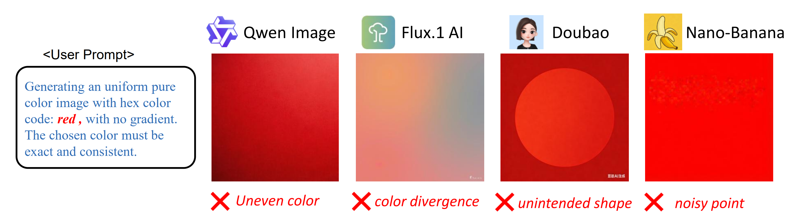

## VIOLIN: Visual L4 Obedience Benchmark
#### Anonymous implementation of the paper: "Exploring the AI Obedience: Why is Generating a Pure Color Image Harder than CyberPunk?"

## 🎨 Introduction


  Recent advances in generative AI have shown human-level performance in complex content creation. 
  However, we identify a "Paradox of Simplicity": models that can render complex scenes often fail at trivial, low-entropy tasks, such as generating a uniform pure color image. 
  We argue this is a systemic failure related to uncontrollable emergent abilities. 
  As models scale, strong priors for aesthetics and complexity override deterministic simplicity, creating an "aesthetic bias" that hinders the model's transition from data simulation to true intellectual abstraction.
  To better investigate this problem, we formalize the concept of AI Obedience, a hierarchical framework that grades a model's ability to transition from probabilistic approximation to pixel-level determinism (Levels 1 to 5).
  We introduce Violin, the first systematic benchmark designed to evaluate Level 4 Obedience through three deterministic tasks: color purity, image masking, and geometric shape generation. 
  Using Violin, we evaluate several state-of-the-art models and reveal that closed-source models generally outperform open-source ones in deterministic precision. Interestingly, performance on our benchmark correlates with the benchmark in natural image generation. 
  Our work provides a foundational framework and tools for achieving better alignment between human instructions and model outputs.


## 📂 Repository Structure
```
├── violin_metrics/         # Part 1: evaluation metrics
│   ├── color_metric.py        # metric for color purity task both var1 and var2
│   ├── mask_metric.py         # metric for image mask task
│   └── shape_metric.py        # metric for geometric generation task
├── eval_open_source/       # Part 2: Inference scripts for open source models
│   ├── evaluate               # evaluation code
│   └── generate               # image generation code
├── eval_closed_source/     # Part 3: API-based model testing
│   ├── evaluate               # evaluation code
│   └── generate               # image generation code by API
├── benchmark/              # Part 4: Benchmark Data
└── requirements       
│   ├── requirement_closed_source.txt
│   └── requirement_open_source.txt
```

## Anonymous Dataset Download

We have provided a complete anonymous link for our data on ...  TODO

## 🚀 Generate and Evaluate with Open-Source Models
### Installation
```bash
conda create -n violin_opensource python=3.10
conda activate violin_opensource
pip install -r requirements/requirement_opensource.txt
```
### Running the Benchmark
**Basic Usage:**
```bash
# Text-to-Image Generation
python eval_open_source/generate/generate_opensource_models.py \
    --model_name "Qwen/Qwen-Image" \
    --prompt "a pure red image" \
    --output_image "output.png"

# Image Editing (for Qwen-Image-Edit models)
python eval_open_source/generate/generate_opensource_models.py \
    --model_name "Qwen/Qwen-Image-Edit-2511" \
    --input_images "image1.png" "image2.png" \
    --prompt "replace the object with a tree" \
    --output_image "edited.png"
```

**Supported Models:**
- FLUX.1 (`black-forest-labs/FLUX.1-schnell`, `black-forest-labs/FLUX.1-dev`)
- FLUX.2 (`black-forest-labs/FLUX.2-klein-4B`, `black-forest-labs/FLUX.2-dev`)
- Z-Image (`Tongyi-MAI/Z-Image`, `Tongyi-MAI/Z-Image-Turbo`)
- Qwen-Image (`Qwen/Qwen-Image`, `Qwen/Qwen-Image-Edit-2511`)

**Key Arguments:**
- `--model_name`: Model path on HuggingFace (required)
- `--input_images`: Input images for editing (optional, space-separated)
- `--width`, `--height`: Image size (default: 1024×1024)
- `--num_inference_steps`: Steps (default: 20)
- `--seed`: Random seed (default: 655)

### Running the Benchmark
Once images are generated, evaluate them using our VIOLIN metrics:
```bash
# Evaluate Color Purity (Variation 1 - Single Block)
python eval_open_source/evaluate/evaluate_open_source_models.py \
    image1.png image2.png \
    --type color

# Evaluate Color Purity (Variation 2 - Dual Block)
python eval_open_source/evaluate/evaluate_open_source_models.py \
    gen_image.png gt_image.png \
    --type color --multi

# Evaluate Image Mask Task
python eval_open_source/evaluate/evaluate_open_source_models.py \
    generated_mask.png ground_truth_mask.png \
    --type mask

# Evaluate Geometric Shape Task
python eval_open_source/evaluate/evaluate_open_source_models.py \
    generated_shape.png ground_truth_shape.png \
    --type shape
```


## 📦Evaluate with Closed-Source Models

### Prerequisites
Please make sure your dataset is in ./benchmark. Run following command to prepare for evaluate. (You can freely choose your pytorch version).

```python
conda create -n violin python=3.10

pip install -r requirements/requirement_closed_source.txt
```

### API Key Setup
We utilized [website](https://api.bltcy.ai/) for API calls, which is an integrated platform for different models.
```
# For Linux/macOS
export GENERATIVE_API_KEY="your_api_key_here"

# For Windows (Command Prompt)
set GENERATIVE_API_KEY=your_api_key_here

```

### Generate Images

Run the following command to generate images on tasks and models, results will be saved in closed_source_results/.

```
# Available models: gpt, nano_banana, doubao

# For Color Purity Task variation-1, single block color
python eval_closed_source/generate/generate_color_var1_task.py --model gpt

# For Color Purity Task variation-2, double block color
python eval_closed_source/generate/generate_color_var2_task.py --model gpt

# For Image Mask Task
python eval_closed_source/generate/generate_mask_task.py --model nano_banana

# For Geometric Generation Task
python eval_closed_source/generate/generate_geometric_task.py --model doubao
```

### Evaluate
Run the following command to evaluate models on three tasks, results will be displayed in the terminal.

```
# Available models: gpt, nano_banana, doubao

# For Color Purity Task variation-1, single block color
python eval_closed_source/evaluate/evaluate_color_task.py --model gpt --var_id 1

# For Color Purity Task variation-2, double block color
python eval_closed_source/evaluate/evaluate_color_task.py --model gpt --var_id 2

# For Image Mask Task
python eval_closed_source/evaluate/evaluate_mask_task.py --model nano_banana

# For Geometric Generation Task
python eval_closed_source/evaluate/evaluate_geometric_task.py --model doubao
```


## 🤝 Acknowledgements

The implementation of our open-source model evaluation suite is built upon the following repositories. We express our sincere gratitude to the authors and contributors for their pioneering work:

*   **[FLUX.1](https://github.com/black-forest-labs/flux)**
*   **[FLUX.2](https://github.com/black-forest-labs/flux2)**
*   **[Z-Image-Model](https://github.com/Tongyi-MAI/Z-Image)**
*   **[Qwen-Image](https://github.com/QwenLM/Qwen-Image)**


These repositories have significantly facilitated our research on visual obedience.


## 📜 License
This project is licensed under the MIT License - see the [LICENSE](LICENSE) file for details.
